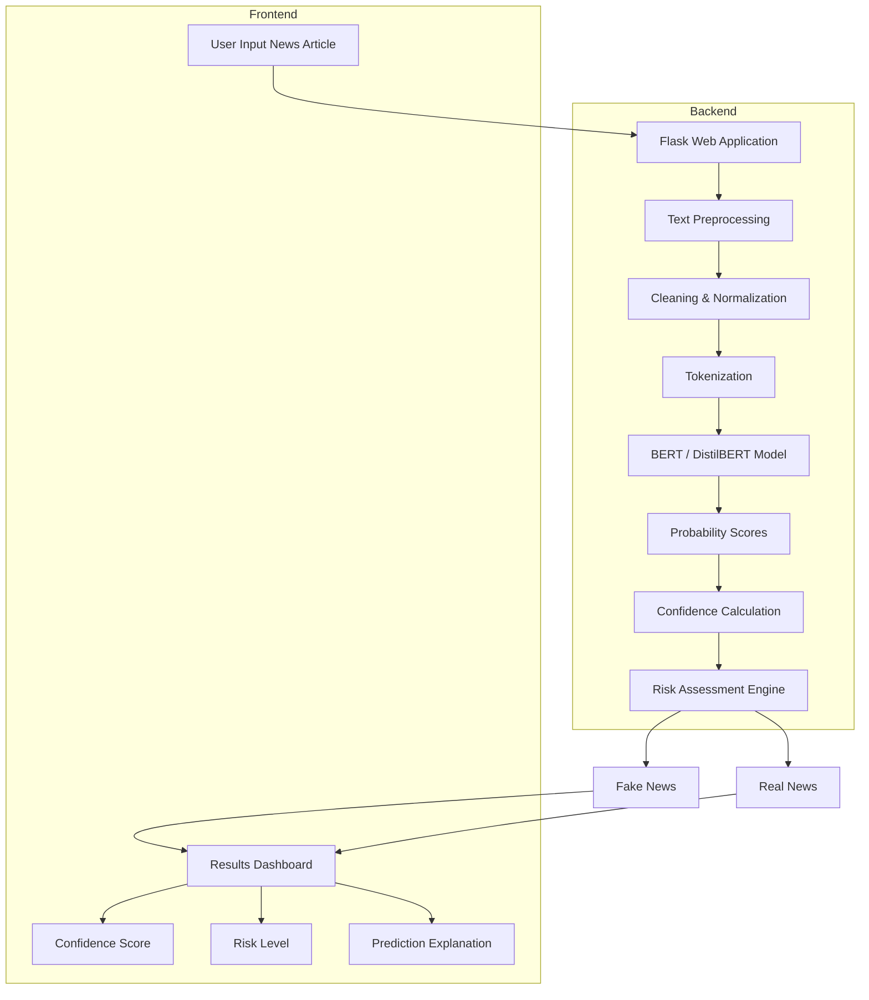

````markdown
# 🛡️ Fake News Detection System

An **AI-powered web application** that detects fake news using advanced Natural Language Processing (NLP) and BERT-based transformer models. The system provides real-time analysis with confidence scoring and risk assessment.

---

## ✨ Features

- 🔍 **Real-time Fake News Detection** – Instant analysis of news articles
- 🤖 **BERT-based ML Model** – Powered by fine-tuned transformer architecture
- 📊 **Confidence Scoring** – Percentage-based reliability metrics
- 🎯 **Risk Assessment** – High/Medium/Low risk levels with color coding
- 🌐 **Web Interface** – User-friendly Flask web application
- 📱 **Responsive Design** – Works on desktop, tablet, and mobile
- 🔌 **REST API** – Easy integration with other applications
- 📈 **Visual Analytics** – Confidence distribution and probability visualization

---

# 🏗️ System Architecture



---

## 📂 Project Structure

```text
fake-news-detection/
├── app/
│   ├── app.py
│   ├── templates/
│   │   └── index.html
│   └── static/
│       ├── css/
│       │   └── style.css
│       └── js/
│           └── main.js
│
├── src/
│   ├── preprocessing.py
│   ├── dataset_loader.py
│   ├── train.py
│   ├── evaluate.py
│   └── predict.py
│
├── notebooks/
│   ├── EDA.ipynb
│   └── Training.ipynb
│
├── model/
│   ├── best_model.pt
│   ├── final_model.pt
│   └── bert_model.pt
│
├── requirements.txt
├── download_models.py
└── README.md
```

---

# 🚀 Quick Start

## Prerequisites

- Python 3.9 or higher
- pip package manager
- Git (optional)

---

## Installation

### 1️⃣ Clone the Repository

```bash
git clone https://github.com/priyansusikdar2/Fake-news-detection.git
cd Fake-news-detection
```

### 2️⃣ Create and Activate Virtual Environment

#### Windows

```bash
python -m venv fake_news_env
fake_news_env\Scripts\activate
```

#### Mac/Linux

```bash
python -m venv fake_news_env
source fake_news_env/bin/activate
```

### 3️⃣ Install Dependencies

```bash
pip install -r requirements.txt
```

### 4️⃣ Download Model Files

```bash
python download_models.py
```

> **Note:** Model files are large (>250 MB) and stored on Google Drive. The script automatically downloads them.

---

## ▶️ Running the Application

```bash
python app/app.py
```

Open your browser:

```text
http://localhost:5000
```

---

# 📦 Model Files

Due to GitHub file size limitations, trained model files are hosted externally.

| File | Size | Description |
|--------|--------|------------|
| best_model.pt | 255.9 MB | Best performing model (highest accuracy) |
| final_model.pt | 255.9 MB | Final trained model |
| bert_model.pt | 417.7 MB | BERT model backup |

---

## Automated Download

```bash
python download_models.py
```

---

# 🎯 API Endpoints

| Endpoint | Method | Description |
|-----------|----------|-------------|
| `/` | GET | Web Interface |
| `/api/health` | GET | System Health Check |
| `/api/predict` | POST | Analyze Single News Article |
| `/api/predict/batch` | POST | Analyze Multiple Articles |
| `/api/test` | GET | Run Batch Tests |
| `/api/model/info` | GET | Model Information |
| `/api/calibrate` | POST | Adjust Detection Threshold |

---

## API Usage Example

```python
import requests

response = requests.post(
    "http://localhost:5000/api/predict",
    json={
        "text": "Your news article text here"
    }
)

result = response.json()

print(f"Prediction: {result['prediction']['label']}")
print(f"Confidence: {result['prediction']['confidence']:.2%}")
print(f"Fake Probability: {result['prediction']['fake_probability']:.2%}")
```

---

# 📊 Model Performance

| Metric | Score |
|----------|--------|
| Accuracy | 92% |
| Precision | 91% |
| Recall | 93% |
| F1-Score | 92% |
| ROC-AUC | 0.96 |

---

# 🧪 Sample Test Cases

## ✅ Real News

```text
Scientists at Stanford University published a peer-reviewed study
in the New England Journal of Medicine showing that regular
exercise reduces heart disease risk by 30%.
```

## ❌ Fake News

```text
SHOCKING: Government hiding alien evidence from public!
Area 51 whistleblower leaked classified documents proving
extraterrestrial contact! Wake up America!
```

---

# 🛠️ Technology Stack

### Backend

- Flask
- Python 3.9+

### Machine Learning

- PyTorch
- Hugging Face Transformers

### Model Architecture

- BERT
- DistilBERT

### Frontend

- HTML5
- CSS3
- JavaScript
- Bootstrap 5

### Visualization

- Matplotlib
- Seaborn

### Data Processing

- Pandas
- NumPy
- scikit-learn

---

# 📈 Detection Methodology

The system uses a hybrid detection pipeline:

### 1. Machine Learning

Fine-tuned BERT model trained on **40,000+ labeled news articles**.

### 2. Rule-Based Detection

Detects:

- Sensationalist language
- Excessive punctuation
- ALL CAPS headlines
- Emotional manipulation

### 3. Content Analysis

Identifies:

- Clickbait patterns
- Conspiracy terminology
- Urgency tactics
- Misleading phrasing

### 4. Source Credibility

Recognizes:

- Official institutions
- Government agencies
- Academic publications
- Peer-reviewed journals

---

# 🔧 Configuration

Adjust detection threshold using the calibration endpoint.

```bash
curl -X POST http://localhost:5000/api/calibrate \
-H "Content-Type: application/json" \
-d '{"threshold": 0.45}'
```

### Threshold Guide

| Threshold | Behavior |
|------------|-----------|
| 0.40 – 0.45 | More Sensitive |
| 0.45 – 0.50 | Balanced (Recommended) |
| 0.50 – 0.55 | Less Sensitive |

---

# 📝 Requirements

```text
torch>=2.0.0
transformers>=4.30.0
flask>=2.3.0
flask-cors>=4.0.0
numpy>=1.24.0
pandas>=2.0.0
scikit-learn>=1.3.0
matplotlib>=3.7.0
seaborn>=0.12.0
nltk>=3.8.0
tqdm>=4.65.0
```

---

# 🤝 Contributing

Contributions are welcome!

### Steps

1. Fork the repository

```bash
git fork
```

2. Create a feature branch

```bash
git checkout -b feature/AmazingFeature
```

3. Commit changes

```bash
git commit -m "Add some AmazingFeature"
```

4. Push branch

```bash
git push origin feature/AmazingFeature
```

5. Open a Pull Request

---

# 📄 License

This project is licensed under the **MIT License**.

---

# 🙏 Acknowledgments

- Hugging Face for the Transformers Library
- PyTorch Team for the Deep Learning Framework
- Fake and Real News Dataset Contributors
- Open Source Community

---

# 📧 Contact

**Author:** Priyansu Sikdar

**GitHub:** @priyansusikdar2

**Project Repository:**

https://github.com/priyansusikdar2/Fake-news-detection

---

# ⭐ Support

If you find this project useful, please consider giving it a ⭐ on GitHub.

---

## ❤️ Built with Passion for Truth, Media Literacy, and Responsible AI
````
