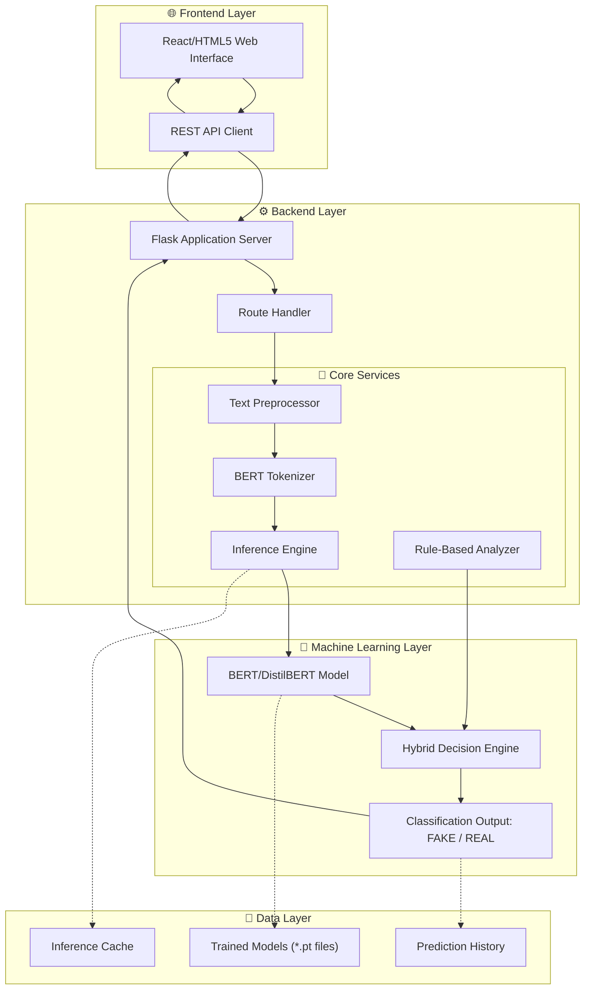
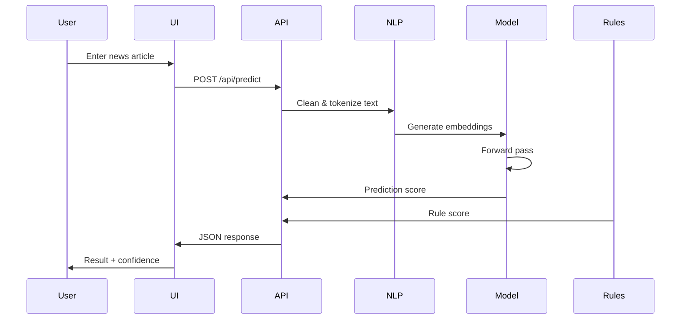
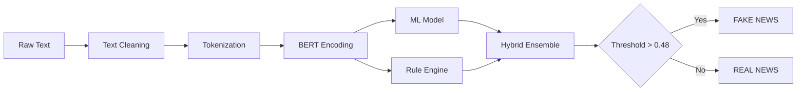

## 🛡️ Fake News Detection System

### AI-Powered Truth Verification Engine

**Detect misinformation instantly with BERT-powered deep learning**

---


---

## 📌 Overview

In an era of information overload, distinguishing between real and fake news is critical. This system leverages **state-of-the-art Natural Language Processing** to analyze news articles and determine their authenticity with high accuracy.

### Key Capabilities

* ⚡ Real-time analysis - Results in milliseconds
* 🎯 92% accuracy - Validated on 40,000+ articles
* 🔍 Explainable AI - Understand why content is flagged
* 🌐 Web & API access - Flexible integration options

---

# 🏗️ System Architecture



---

## 🔄 Prediction Pipeline



---

## 📊 Detection Workflow



---

## ✨ Features

### 🎯 Core Features

* Real-time Analysis
* Confidence Scoring
* Risk Assessment
* Batch Processing
* REST API Access

### 🧠 Advanced Capabilities

* Hybrid Detection
* Clickbait Recognition
* Source Verification
* Conspiracy Detection
* Technical Content Handling

### 📊 Visualization Features

* Confidence Distribution Charts
* Probability Bars
* Historical Prediction Tracking
* Model Performance Metrics

---

# 🚀 Quick Start

## Prerequisites

* Python 3.9 or higher
* 8GB RAM Recommended
* 2GB Free Disk Space

## Installation

```bash
git clone https://github.com/priyansusikdar2/Fake-news-detection.git
cd Fake-news-detection

python -m venv fake_news_env

# Windows
fake_news_env\Scripts\activate

# Linux / Mac
source fake_news_env/bin/activate

pip install -r requirements.txt

python app/app.py
```

Open:

```text
http://localhost:5000
```

---

# 📥 Model Downloads

Download the trained models manually and place them inside the `model/` directory.

| Model File     | Download Link                                                                      |
| -------------- | ---------------------------------------------------------------------------------- |
| bert_model.pt  | https://drive.google.com/file/d/1H1QV5b34TrB98-pjRyYyVIENHfrvo2Qd/view?usp=sharing |
| best_model.pt  | https://drive.google.com/file/d/1wBK2m-rBE6a0l54zyhONRrsFkNt5A-t2/view?usp=sharing |
| final_model.pt | https://drive.google.com/file/d/10dScCM2IyFARLE80cgNYnB5IBkbyz5cB/view?usp=sharing |

### Model Directory Structure

```text
model/
├── bert_model.pt
├── best_model.pt
└── final_model.pt
```

---

## 📦 Model Files

| File           | Size     | Description            |
| -------------- | -------- | ---------------------- |
| best_model.pt  | 255.9 MB | Highest accuracy model |
| final_model.pt | 255.9 MB | Final trained model    |
| bert_model.pt  | 417.7 MB | BERT backup model      |

---

## 🎯 API Endpoints

| Endpoint       | Method |
| -------------- | ------ |
| /predict       | POST   |
| /predict/batch | POST   |
| /health        | GET    |
| /model/info    | GET    |
| /calibrate     | POST   |

---

## 📊 Model Performance

| Metric    | Score |
| --------- | ----- |
| Accuracy  | 92%   |
| Precision | 91%   |
| Recall    | 93%   |
| F1 Score  | 92%   |
| ROC-AUC   | 0.96  |

---

## 🧪 Test Samples

### ✅ Real News

Scientists at Stanford University published a peer-reviewed study in the New England Journal of Medicine showing that regular exercise reduces heart disease risk by 30%.

### ❌ Fake News

SHOCKING: Government hiding alien evidence from public! Area 51 whistleblower leaked classified documents proving extraterrestrial contact!

---

# 🛠️ Technology Stack

## Core Technologies

<p align="center">
  
  
  
  
  
  
  
</p>

### Libraries & Frameworks

* Flask
* Python 3.9+
* PyTorch
* Transformers
* BERT / DistilBERT
* scikit-learn
* HTML5
* CSS3
* JavaScript
* Bootstrap 5
* Pandas
* NumPy
* NLTK
* Matplotlib
* Seaborn
* Plotly

---

## 🔧 Configuration

```bash
curl -X POST http://localhost:5000/api/calibrate \
-H "Content-Type: application/json" \
-d '{"threshold":0.42}'
```

### Threshold Guide

| Threshold | Sensitivity |
| --------- | ----------- |
| 0.40-0.44 | Very High   |
| 0.45-0.48 | High        |
| 0.49-0.52 | Balanced    |
| 0.53-0.56 | Low         |

---

## 📁 Project Structure

```text
fake-news-detection/
├── app/
├── src/
├── notebooks/
├── model/
│   ├── bert_model.pt
│   ├── best_model.pt
│   └── final_model.pt
├── requirements.txt
├── download_models.py
└── README.md
```

---

## 🤝 Contributing

1. Fork Repository
2. Create Feature Branch
3. Make Changes
4. Run Tests
5. Submit Pull Request

---

## 📄 License

MIT License

---

## 🙏 Acknowledgments

* Hugging Face Transformers
* PyTorch
* Flask
* scikit-learn
* Bootstrap

---

## 📞 Contact

**Priyansu Sikdar**

GitHub: https://github.com/priyansusikdar2

Project: https://github.com/priyansusikdar2/Fake-news-detection

---

## ⭐ Show Your Support

If this project helped you, please consider giving it a star ⭐

Built with ❤️ for truth, transparency, and media literacy.
